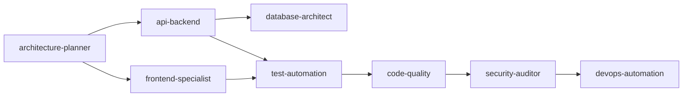

# 🤖 Claude Agents - Enterprise AI Agent System for SDLC/SSDLC

[](https://opensource.org/licenses/MIT)
[](https://github.com/pfangueiro/claude-code-agents)
[](https://claude.ai/code)
[](https://claudeskills.info)
[](https://modelcontextprotocol.io)

**Auto-activating AI agents that respond to natural language** - no commands needed! Just describe what you want to build, and specialized agents automatically engage to help.

## ✨ Key Features

- 🚀 **Zero Configuration** - Agents activate automatically based on natural language
- 💰 **70% Cost Savings** - Intelligent model selection (Haiku/Sonnet/Opus)
- 🔒 **Security First** - OWASP & DevSecOps practices built-in
- 🎯 **Full SDLC Coverage** - 11 specialized agents from planning to production
- 🤝 **Multi-Agent Collaboration** - Agents work together seamlessly
- 🎓 **Skills System** - Extend capabilities with modular knowledge packages
- 🌐 **MCP Integration** - External tools and data via Model Context Protocol
- 🔌 **4-Way Extensibility** - Skills, MCP, Slash Commands, and Subagents
- 📊 **Enterprise Ready** - Production-grade with telemetry and monitoring

## 🚀 Quick Start

### Team Setup (Recommended)

Clone the repo and run the team installer to get agents, skills, commands, hooks, statusline, keybindings, and output styles:

```bash
git clone git@github.com:pfangueiro/claude-code-agents.git
cd claude-code-agents
./install.sh --team-setup
```

This installs:

| Component | Scope | What |
|-----------|-------|------|
| Agents (12) | Project `.claude/agents/` | Auto-activating SDLC specialists |
| Skills (11) | Project `.claude/skills/` | Modular knowledge packages |
| Library files | Project `.claude/lib/` | Activation patterns & templates |
| Slash commands (3) | Project `.claude/commands/` | `/new-feature`, `/commit-pr`, `/create-jira` |
| MCP servers (6) | Global config | context7, sequential-thinking, playwright, github, postgres, brave-search |
| Hooks (3) | Global `~/.claude/hooks/` | Notifications, auto-lint, pre-commit |
| Statusline | Global `~/.claude/statusline.sh` | Rich status bar (model, git, cost, context) |
| Keybindings (6) | Global `~/.claude/keybindings.json` | Ctrl+S/P/T/R/J/D shortcuts |
| Output style | Global `~/.claude/output-styles/` | Concise, code-first responses |
| Settings | Global `~/.claude/settings.json` | Model, hooks, deny rules, attribution |
| CLAUDE.md | Global `~/.claude/CLAUDE.md` | Personal coding preferences |

### Project-Only Installation

If you only need agents for a specific project (no global config):

```bash
cd /path/to/your/project
/path/to/claude-code-agents/install.sh --full
```

### That's It!

Now just use natural language:
- "Design a REST API for user management"
- "Check this code for security issues"
- "Why is this query running slow?"
- "Deploy this to AWS"

Agents will **automatically activate** based on your words!

## 🤖 Available Agents

| Agent | Triggers | Specialization | Model |
|-------|----------|----------------|-------|
| **architecture-planner** 🏗️ | design, architecture, system | System design, API specs, ADRs | Sonnet |
| **code-quality** 🔍 | review, refactor, quality | Code review, best practices | Sonnet |
| **security-auditor** 🔒 | security, auth, vulnerability | OWASP scanning, security fixes | **Opus** |
| **test-automation** ✅ | test, coverage, TDD | Test generation, coverage analysis | Sonnet |
| **performance-optimizer** ⚡ | slow, optimize, bottleneck | Profiling, caching, optimization | Sonnet |
| **devops-automation** 🚀 | deploy, CI/CD, Docker | Deployment, containerization | Sonnet |
| **documentation-maintainer** 📚 | document, README, guide | Docs, API specs | **Haiku** |
| **database-architect** 🗄️ | database, SQL, schema | Query optimization, migrations | Sonnet |
| **frontend-specialist** 🎨 | UI, React, frontend | Components, responsive design | Sonnet |
| **api-backend** 🔧 | API, backend, endpoint | REST/GraphQL, business logic | Sonnet |
| **incident-commander** 🚨 | CRITICAL, outage, emergency | Rapid response, root cause | **Opus** |

## 💡 How It Works

### Natural Language Activation

Just describe your task normally:

```
You: "I need to build a user authentication system with email verification"
```

**Auto-triggers these agents:**
1. **architecture-planner** → Designs the system architecture
2. **api-backend** → Implements authentication logic
3. **database-architect** → Creates user schema
4. **security-auditor** → Ensures secure implementation
5. **test-automation** → Generates comprehensive tests
6. **documentation-maintainer** → Documents the API

### Multi-Agent Workflows

Agents collaborate automatically:



## 📦 Installation Options

### Team Setup (Full Onboarding)
```bash
./install.sh --team-setup
```
Installs agents, skills, commands, hooks, statusline, keybindings, output styles, and global settings.

### Interactive Mode
```bash
./install.sh
```
Detects existing setup and recommends best option.

### Minimal Installation
```bash
./install.sh --minimal
```
Just adds CLAUDE.md for agent activation.

### Full Installation
```bash
./install.sh --full
```
Installs all agents and supporting files.

### Repair Mode
```bash
./install.sh --repair
```
Fixes missing components.

### Update Mode
```bash
./install.sh --update
```
Updates to latest version.

## 🏗️ Architecture

```
.claude/
├── agents/                    # 11 specialized SDLC agents
│   ├── architecture-planner.md
│   ├── code-quality.md
│   ├── security-auditor.md
│   ├── test-automation.md
│   ├── performance-optimizer.md
│   ├── devops-automation.md
│   ├── documentation-maintainer.md
│   ├── database-architect.md
│   ├── frontend-specialist.md
│   ├── api-backend.md
│   ├── incident-commander.md
│   └── meta-agent.md         # Creates new agents
├── commands/                  # Slash commands
│   ├── new-feature.md         # /new-feature PROJ-XXX desc
│   ├── commit-pr.md           # /commit-pr [message]
│   └── create-jira.md         # /create-jira type [epic] title
├── skills/                    # Modular knowledge packages (11 total)
│   ├── skill-creator/         # Create new skills
│   ├── git-workflow/          # Git best practices
│   ├── code-review-checklist/ # Review guidelines
│   ├── deployment-runbook/    # Deployment procedures
│   ├── api-guidelines/        # API design patterns
│   ├── ui-guidelines/         # UI/UX best practices
│   ├── ci-cd-templates/       # GitHub Actions, GitLab CI templates
│   ├── api-contract-testing/  # OpenAPI validation & PACT
│   ├── docker-deployment/     # Docker best practices
│   ├── library-docs/          # MCP: Library documentation
│   └── deep-analysis/         # MCP: Deep reasoning
├── lib/
│   ├── agent-templates.json  # Pre-built templates
│   ├── sdlc-patterns.md      # SDLC phase detection
│   └── activation-keywords.json # NLP activation patterns
└── history/                   # Telemetry & learning

global-config/                 # Team-shareable global config
├── hooks/                     # 3 hooks: notify, post-edit-lint, pre-commit
├── output-styles/             # Concise output style
├── statusline.sh              # Rich status bar
├── keybindings.json           # 6 keyboard shortcuts
├── settings.json.template     # Global settings (MCP, hooks, permissions)
└── CLAUDE.md.template         # Personal preferences template
```

## 💰 Cost Optimization

Smart model selection for ~70% savings:

| Model | Cost | Usage |
|-------|------|-------|
| **Haiku** | $0.80/1M tokens | Documentation (95% savings) |
| **Sonnet** | $3/1M tokens | Standard development |
| **Opus** | $15/1M tokens | Security & critical incidents |

## 🎓 Skills System

Extend agent capabilities with modular knowledge packages. While **agents execute tasks**, **skills provide specialized knowledge and tools**.

### What Are Skills?

| **Agents** | **Skills** |
|------------|------------|
| Auto-activating task executors | Modular knowledge packages |
| Execute SDLC workflows | Provide domain expertise |
| Examples: security-auditor, test-automation | Examples: git-workflow, brand-guidelines |

### Creating Skills

```bash
# Create a new skill
python3 .claude/skills/skill-creator/scripts/init_skill.py my-skill --path .claude/skills

# Skills bundle:
# - scripts/ (executable code)
# - references/ (documentation)
# - assets/ (templates, images)
```

### Agent + Skill Power Combos

- **code-quality** + **code-review-checklist** → Review with your standards
- **devops-automation** + **deployment-runbook** → Deploy with your procedures
- **documentation-maintainer** + **brand-guidelines** → Document with your style
- **architecture-planner** + **deep-analysis** (MCP) → Structured architectural decisions
- **documentation-maintainer** + **library-docs** (MCP) → Doc with library patterns

See `.claude/skills/README.md` for complete documentation.

## 🌐 MCP Integration

**Model Context Protocol (MCP)** enables external tools and data sources to seamlessly integrate with Claude Code.

### MCP-Powered Skills

This project includes two MCP-powered skills demonstrating the integration:

#### 1. **library-docs** (uses context7 MCP server)
- **What**: Fetch up-to-date documentation for 100+ libraries
- **Examples**: React, Next.js, Vue, MongoDB, Supabase, PostgreSQL
- **Usage**: "Show me React hooks documentation"

```javascript
// Fetches official library documentation on-demand
mcp__context7__get-library-docs({
  context7CompatibleLibraryID: "/facebook/react",
  topic: "hooks"
})
```

#### 2. **deep-analysis** (uses sequential-thinking MCP server)
- **What**: Structured multi-step reasoning for complex decisions
- **Capabilities**: Up to 31,999 thinking tokens (vs 4,000 standard)
- **Usage**: "Should we use microservices or monolith?"

```javascript
// Enables deep reasoning with hypothesis testing
mcp__sequential-thinking-server__sequentialthinking({
  thought: "Analyzing architectural trade-offs...",
  thoughtNumber: 1,
  totalThoughts: 10
})
```

### Included MCP Servers (6 Total)

The team setup automatically configures these MCP servers:

| MCP Server | Purpose | Example Usage |
|------------|---------|---------------|
| **context7** | Library documentation (React, Next.js, Vue, etc.) | "Show React hooks docs" |
| **sequential-thinking** | Deep structured reasoning (31,999 tokens) | "Analyze microservices vs monolith" |
| **playwright** | Browser automation & E2E testing | "Test login flow" |
| **github** | PR/issue management, workflows | "Create PR from this branch" |
| **postgres** | Database queries & optimization | "Analyze this query plan" |
| **brave-search** | Web research & up-to-date information | "Search for best Next.js patterns" |

### Manual MCP Configuration

If not using team setup, add to your Claude Code settings:

```bash
# Install MCP servers
claude mcp add context7 -- npx @upstash/context7-mcp@latest
claude mcp add sequential-thinking-server -- npx @modelcontextprotocol/server-sequential-thinking
claude mcp add playwright -- npx @executeautomation/playwright-mcp-server
claude mcp add github -- npx -y @modelcontextprotocol/server-github
claude mcp add postgres -- npx -y @modelcontextprotocol/server-postgres
claude mcp add brave-search -- npx -y @modelcontextprotocol/server-brave-search
```

### Four Extensibility Mechanisms

```
┌─────────────────────────────────────────────────────────────┐
│                    Claude Code Platform                      │
├─────────────────────────────────────────────────────────────┤
│                                                               │
│  ┌──────────┐  ┌──────────┐  ┌──────────┐  ┌──────────┐   │
│  │  Skills  │  │   MCP    │  │  Slash   │  │Subagents │   │
│  │  (Blue)  │  │ (Green)  │  │Commands  │  │ (Orange) │   │
│  │Knowledge │  │  Tools   │  │  (Red)   │  │ Isolated │   │
│  └──────────┘  └──────────┘  └──────────┘  └──────────┘   │
│                                                               │
└─────────────────────────────────────────────────────────────┘
```

| Mechanism | Purpose | Example |
|-----------|---------|---------|
| **Skills** | Knowledge & methodology | `git-workflow`, `library-docs` |
| **MCP** | External tools & data | `context7`, `sequential-thinking` |
| **Slash Commands** | User-triggered workflows | `/deploy-prod`, `/review-pr` |
| **Subagents** | Isolated task execution | `architecture-planner`, `security-auditor` |

**See [EXTENSIBILITY.md](./EXTENSIBILITY.md) for the complete guide on all four mechanisms.**

## ⌨️ Global Keybindings

The team setup configures these keyboard shortcuts (works in all projects):

| Keybinding | Command | Description |
|------------|---------|-------------|
| `Ctrl+S` | `commit` | Quick commit with auto-generated message |
| `Ctrl+P` | `plan` | Enter plan mode for complex tasks |
| `Ctrl+T` | `commit-pr` | Commit and create pull request |
| `Ctrl+R` | `code-quality` | Trigger code review agent |
| `Ctrl+J` | `create-jira` | Create JIRA ticket from context |
| `Ctrl+D` | `deep-analysis` | Activate deep reasoning skill |

## 🪝 Global Hooks

Three hooks are configured for automation:

1. **notify.sh** - Desktop notifications when Claude needs attention
2. **post-edit-lint.sh** - Auto-lint TypeScript/JavaScript after Write/Edit
3. **pre-commit.sh** - Validate conventional commit messages (manual Git integration)

## 🔥 Advanced Features

### Meta-Agent System

The **meta-agent** can generate new specialized agents:

```bash
# Example: Create a GraphQL specialist
"Create an agent specialized in GraphQL API development"
```

### Security-First Approach

- **Security scanning** auto-activates on auth/security keywords
- **OWASP Top 10** compliance built-in
- **DevSecOps** best practices embedded
- **Opus model** always used for security tasks

### Telemetry & Learning

- Tracks activation accuracy
- Monitors task completion rates
- Optimizes model selection
- Refines activation patterns

## 📖 Usage Examples

### Example 1: Building a Feature
```
You: "Build a shopping cart with Stripe integration"

Agents activated:
→ architecture-planner (designs system)
→ api-backend (implements logic)
→ database-architect (designs schema)
→ security-auditor (validates payment security)
→ test-automation (creates tests)
→ documentation-maintainer (documents API)
```

### Example 2: Performance Issue
```
You: "The product search is running really slow"

Agents activated:
→ performance-optimizer (profiles code)
→ database-architect (optimizes queries)
→ code-quality (suggests improvements)
```

### Example 3: Production Emergency
```
You: "CRITICAL: Production API is returning 500 errors!"

Agents activated:
→ incident-commander (takes charge with Opus)
→ security-auditor (checks for breaches)
→ devops-automation (prepares rollback)
```

## 🛠️ Configuration

### CLAUDE.md

The system uses `CLAUDE.md` in your project root for configuration. The installer handles this automatically.

### Manual Setup

If you prefer manual setup, copy the minimal configuration:

```bash
cp CLAUDE-minimal.md /your/project/CLAUDE.md
```

## 🧪 Development

### Creating Custom Agents

Use the meta-agent to generate new specialists:

```bash
# The meta-agent will auto-activate when you say:
"Create an agent for React Native development"
```

### Contributing

1. Fork the repository
2. Create your feature branch (`git checkout -b feature/NewAgent`)
3. Commit your changes (`git commit -m 'Add new agent'`)
4. Push to the branch (`git push origin feature/NewAgent`)
5. Open a Pull Request

## 📊 Performance Metrics

Based on real-world usage:

- ⚡ **90ms** average activation time
- 📈 **30% productivity gain** through intelligent routing
- 💰 **70% cost reduction** via smart model selection
- 🎯 **85% activation accuracy** with NLP patterns

## 🔒 Security

- All security tasks use **Opus model** for maximum intelligence
- **OWASP Top 10** vulnerability scanning
- **SOC2/ISO 27001** compliance checks
- **DevSecOps** practices throughout
- Automatic security scanning on auth-related keywords

## 📝 License

MIT License - see [LICENSE](LICENSE) file for details.

## 🤝 Support

- **Issues**: [GitHub Issues](https://github.com/pfangueiro/claude-code-agents/issues)
- **Discussions**: [GitHub Discussions](https://github.com/pfangueiro/claude-code-agents/discussions)
- **Updates**: Run `./install.sh --update` for latest version

## 🌟 Why Claude Agents?

Unlike traditional CLI tools that require memorizing commands, Claude Agents:

1. **Understand context** - Agents activate based on what you're trying to do
2. **Work together** - Multiple agents collaborate automatically
3. **Learn and improve** - Telemetry refines activation patterns
4. **Save money** - Optimal model selection for each task
5. **Zero friction** - No commands to remember

## 🚀 Getting Started

1. **Clone and install**
   ```bash
   git clone git@github.com:pfangueiro/claude-code-agents.git
   cd claude-code-agents && ./install.sh --team-setup
   ```

2. **Use natural language** (that's it!)
   ```
   "Help me build a REST API with authentication"
   ```

3. **Watch agents work**
   - Multiple specialists collaborate
   - Automatic security scanning
   - Tests generated
   - Documentation created

## 📈 Roadmap

- [ ] VS Code extension
- [ ] Web dashboard for telemetry
- [ ] Additional specialized agents
- [ ] Multi-language support
- [ ] Team collaboration features
- [ ] AI model fine-tuning

## 🏆 Credits

Created by Pedro Fangueiro ([@pfangueiro](https://github.com/pfangueiro))

Built with Claude (Anthropic) and modern AI agent architecture patterns.

---

<div align="center">

**No configuration. No commands. Just describe what you need.**

⭐ Star this repo if you find it useful!

</div>