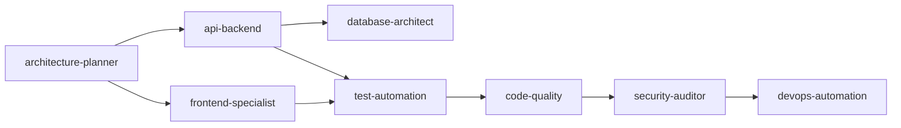

# Claude Agents - AI-Powered SDLC Agent System

[](https://opensource.org/licenses/MIT)
[](https://github.com/pfangueiro/claude-code-agents/releases)
[](https://docs.anthropic.com/en/docs/claude-code)
[](#-available-agents)
[](#-skills-system)
[](#-mcp-integration)

**12 auto-activating AI agents for every phase of software development.** Just describe what you want to build — the right specialists engage automatically.

> Works with [Claude Code](https://docs.anthropic.com/en/docs/claude-code) (Anthropic's CLI). No plugins, no configuration, no commands to memorize.

---

## 30-Second Setup

```bash
git clone https://github.com/pfangueiro/claude-code-agents.git
cd claude-code-agents
./install.sh --team-setup
```

Then open any project with Claude Code and talk naturally:

```
"Build a REST API with JWT authentication"
"This query is running slow"
"Check for security vulnerabilities"
"Deploy to production"
```

Agents activate automatically based on your words.

---

## What You Get

| Component | Count | What It Does |
|-----------|-------|--------------|
| **Agents** | 12 | Auto-activating SDLC specialists (planning through production) |
| **Skills** | 16 | Modular knowledge packages (git, Docker, CI/CD, API design, security-scan, execute, investigate, etc.) |
| **Slash Commands** | 12 | `/commit-pr`, `/review-pr`, `/security-scan`, `/compact`, `/new-feature`, `/create-jira`, `/build-fix`, `/tdd`, `/quality-gate`, `/checkpoint`, `/save-session`, `/resume-session` |
| **MCP Servers** | 5 | context7, sequential-thinking, playwright, github, postgres |
| **Rules** | 4 | Auto-enforced security, code quality, fix quality, and verification standards |
| **Hooks** | 9 | Agent tracking, session lifecycle, permission auditing, file protection, auto-lint, debug detection, pre-compact snapshots, notifications |
| **Keybindings** | 6 | Ctrl+S (commit), Ctrl+T (PR), Ctrl+R (review), etc. |

---

## Available Agents

| Agent | Activates On | Does What | Model |
|-------|-------------|-----------|-------|
| **architecture-planner** | "design", "architecture", "system" | System design, API specs, ADRs | Sonnet |
| **code-quality** | "review", "refactor", "quality" | Code review, best practices | Sonnet |
| **security-auditor** | "security", "auth", "vulnerability" | OWASP scanning, security fixes | **Opus** |
| **test-automation** | "test", "coverage", "TDD" | Test generation, coverage analysis | Sonnet |
| **performance-optimizer** | "slow", "optimize", "bottleneck" | Profiling, caching, optimization | Sonnet |
| **devops-automation** | "deploy", "CI/CD", "Docker" | Deployment, containerization | Sonnet |
| **documentation-maintainer** | "document", "README", "guide" | Docs, API specs | **Haiku** |
| **database-architect** | "database", "SQL", "schema" | Query optimization, migrations | Sonnet |
| **frontend-specialist** | "UI", "React", "frontend" | Components, responsive design | Sonnet |
| **api-backend** | "API", "backend", "endpoint" | REST/GraphQL, business logic | Sonnet |
| **incident-commander** | "CRITICAL", "outage", "emergency" | Rapid response, root cause | **Opus** |
| **meta-agent** | "create an agent for..." | Generates new custom agents | Opus |

**Cost optimization:** Haiku for docs (95% cheaper), Sonnet for dev work, Opus for security/emergencies.

---

## How Agents Collaborate

Agents hand off work automatically. Example: *"Build a user registration system"*


```mermaid
graph LR
    A[architecture-planner] --> B[frontend-specialist]
    A --> C[api-backend]
    C --> D[database-architect]
    B --> E[test-automation]
    C --> E
    E --> F[code-quality]
    F --> G[security-auditor]
    G --> H[devops-automation]
```

See [`.claude/lib/agent-coordination.md`](.claude/lib/agent-coordination.md) for the formal handoff protocol.

---

## Installation Options

| Mode | Command | What It Does |
|------|---------|-------------|
| **Team Setup** | `./install.sh --team-setup` | Everything: agents, skills, commands, hooks, keybindings, MCP, global config |
| **Full** | `./install.sh --full` | Agents + skills + commands for one project (no global config) |
| **Minimal** | `./install.sh --minimal` | Just CLAUDE.md with agent activation |
| **Repair** | `./install.sh --repair` | Fix missing components |
| **Update** | `./install.sh --update` | Update to latest version |
| **Validate** | `./validate.sh` | Verify all 136 checks pass |

### Deploy to an Existing Project

```bash
cd /path/to/your/project
/path/to/claude-code-agents/install.sh --full
```

### Verify Installation

```bash
./validate.sh
# All validations passed! (136/136 checks)
```

---

## Slash Commands

### Project Workflow

| Command | Usage | What It Does |
|---------|-------|-------------|
| `/commit-pr` | `/commit-pr [message]` | Stage, commit, push, create PR, update JIRA |
| `/review-pr` | `/review-pr 123` | Code quality + security + testing review |
| `/security-scan` | `/security-scan [path]` | OWASP scanning, secrets detection, dependency audit |
| `/compact` | `/compact [note]` | Write HANDOFF.md with session context, then compact conversation |
| `/new-feature` | `/new-feature PROJ-123 desc` | Create feature branch from latest main |
| `/create-jira` | `/create-jira epic Title` | Create JIRA issue and assign to you |

### Developer Workflow (new in v2.5.0)

| Command | Usage | What It Does |
|---------|-------|-------------|
| `/build-fix` | `/build-fix [path]` | Auto-detect build system, fix errors one at a time with regression guard |
| `/tdd` | `/tdd <feature>` | Enforce RED-GREEN-REFACTOR: failing test → implement → refactor |
| `/quality-gate` | `/quality-gate [path] [--fix]` | Pre-commit validation: formatter + linter + type checker + tests |
| `/checkpoint` | `/checkpoint <name>` | Named save points via git branches for complex multi-step work |
| `/save-session` | `/save-session [id]` | Save structured session state with mandatory "What Did NOT Work" section |
| `/resume-session` | `/resume-session [id]` | Resume from a saved session with context briefing and file state verification |

---

## Skills System

Skills provide domain knowledge that agents apply. 16 included:

| Skill | What It Provides |
|-------|-----------------|
| **git-workflow** | Branching strategies, conventional commits, PR workflows |
| **code-review-checklist** | 10-category review framework, security checklist |
| **deployment-runbook** | Blue-green deployment, rollback procedures, health checks |
| **api-guidelines** | REST/GraphQL patterns, input validation, error handling |
| **api-contract-testing** | OpenAPI validation, PACT testing, mock servers |
| **ui-guidelines** | React/Next.js patterns, Ant Design, responsive design |
| **ci-cd-templates** | GitHub Actions, GitLab CI, deployment strategies |
| **docker-deployment** | Multi-stage builds, Docker Compose, security |
| **execute** | Orchestrated task engine: decompose goals, plan dependencies, parallel execution |
| **investigate** | 8-phase root cause analysis: observe, reproduce, trace, hypothesize, prove, fix, prevent |
| **library-docs** | MCP-powered: fetch docs for React, Next.js, Vue, etc. |
| **deep-analysis** | MCP-powered: structured reasoning with branching and revision (rewritten) |
| **deep-read** | 6-phase codebase reading engine: scope, map, trace, deep read, connect, report |
| **handoff** | Session continuity — write HANDOFF.md for cross-session context |
| **security-scan** | Auto-activating security scanner (secrets, OWASP, dependencies, file permissions) |
| **skill-creator** | Create your own custom skills |

### Create Your Own Skill

```bash
python3 .claude/skills/skill-creator/scripts/init_skill.py my-skill --path .claude/skills
```

---

## MCP Integration

5 Model Context Protocol servers auto-configured with team setup:

| Server | What It Does |
|--------|-------------|
| **context7** | Fetch documentation for 100+ libraries on-demand |
| **sequential-thinking** | Deep structured reasoning (31,999 thinking tokens) |
| **playwright** | Browser automation and E2E testing |
| **github** | PR/issue management via GitHub API |
| **postgres** | Database queries and optimization |

### Manual MCP Setup

```bash
claude mcp add context7 -- npx @upstash/context7-mcp@latest
claude mcp add sequential-thinking-server -- npx @modelcontextprotocol/server-sequential-thinking
claude mcp add playwright -- npx @executeautomation/playwright-mcp-server
claude mcp add github -- npx -y @modelcontextprotocol/server-github
claude mcp add postgres -- npx -y @modelcontextprotocol/server-postgres
```

---

## Auto-Enforced Rules

Four rule files in `.claude/rules/` are automatically loaded by Claude Code in every session:

- **security.md** — No secrets in commits, parameterized queries, input validation, security headers, least privilege
- **code-quality.md** — No dead code, single responsibility, early returns, explicit error handling, descriptive naming
- **fix-quality.md** — Root cause analysis before fixing, never suppress errors, minimal changes, test-driven fixing
- **verification.md** — Verify after every implementation, run tests, build to catch errors, test-driven bug fixes

---

## Hooks

9 hook events across 7 command hooks, installed globally to `~/.claude/hooks/`:

| Hook | Event | What It Does |
|------|-------|-------------|
| **file-protection.sh** | PreToolUse | Blocks edits to sensitive files (.env, *.key, *.pem, secrets/) |
| **post-edit-lint.sh** | PostToolUse | Auto-lints TS/JS after Write/Edit, warns on debug statements |
| **notify.sh** | Notification | Desktop alert when Claude needs attention |
| **agent-tracker.sh** | SubagentStart/Stop | Real-time agent lifecycle tracking to analytics |
| **session-end.sh** | Stop | Logs session completion for observability |
| **smart-guard.sh** | PermissionRequest | Auto-approves safe reads, audits dangerous operations |
| **pre-compact.sh** | PreCompact | Auto-saves session snapshot before context compaction |

**Phase 2 reference configs** (opt-in, not enabled by default):
- `smart-file-guard.json` — prompt hook: LLM-based file protection
- `pre-commit-review.json` — agent hook: automated code review before commit

---

## Architecture

```
.claude/
├── agents/          # 12 auto-activating SDLC agents
├── commands/        # 12 slash commands
├── skills/          # 16 modular knowledge packages
├── rules/           # 4 auto-enforced rule sets
├── lib/             # Templates, patterns, coordination protocol
└── history/         # Session history

global-config/
├── hooks/           # 7 command hooks + 2 reference configs
├── settings.json.template  # 9 hook events, permissions, model config
└── ...              # keybindings, statusline, output styles
```

See [EXTENSIBILITY.md](./EXTENSIBILITY.md) for the complete guide on Skills, MCP, Slash Commands, and Subagents.

---

## Usage Examples

**Building a feature:**
```
You: "Build a shopping cart with Stripe integration"
  → architecture-planner designs the system
  → api-backend implements payment logic
  → database-architect creates order schema
  → security-auditor validates payment security
  → test-automation generates tests
  → documentation-maintainer documents the API
```

**Performance issue:**
```
You: "The product search is running really slow"
  → performance-optimizer profiles the code
  → database-architect optimizes queries
  → code-quality suggests improvements
```

**Production emergency:**
```
You: "CRITICAL: Production API is returning 500 errors!"
  → incident-commander takes charge (Opus)
  → security-auditor checks for breaches
  → devops-automation prepares rollback
```

---

## Observability Dashboard

Built-in analytics dashboard that reads Claude Code's native JSONL session logs — zero cloud dependencies, Python stdlib only, single SQLite database.

```bash
# Quick start (after install --team-setup)
claude-obs

# Or run manually
python3 ~/.claude/analytics/collector.py    # Ingest JSONL → SQLite
python3 ~/.claude/analytics/server.py --open # Serve dashboard at localhost:3141
```

**Dashboard panels:**
- **Summary cards** — total cost, projects, sessions, agent activations, input/output tokens
- **Daily cost & sessions** — dual-axis bar+line chart with configurable time ranges (7d/14d/30d/All)
- **Cost by project** — horizontal bar chart ranking projects by spend
- **Agent activations** — which agents are used most and across how many projects
- **Model distribution** — doughnut chart showing Opus/Sonnet/Haiku cost split
- **Top projects by tokens** — token consumption per project
- **Sessions table** — recent sessions with project, duration, cost, model, and agents used

**Architecture:**
- **Data source**: `~/.claude/projects/**/*.jsonl` (Claude Code writes these automatically)
- **Collector** (`collector.py`): incremental JSONL scanner with per-file watermarks, per-model cost estimation (Opus/Sonnet/Haiku pricing)
- **Storage**: SQLite with WAL mode at `~/.claude/analytics/claude-obs.db`
- **Server** (`server.py`): 6 JSON API endpoints + static file server on `localhost:3141`
- **Dashboard** (`dashboard.html`): single-file dark-themed UI with Chart.js

**CLI options:**
```bash
python3 collector.py --full          # Re-ingest everything (ignore watermarks)
python3 collector.py --db /path/to.db # Custom database path
python3 server.py --port 8080        # Custom port
python3 server.py --open             # Auto-open browser
```

Installed automatically with `--team-setup`. Data stays entirely local.

---

## Contributing

1. Fork the repository
2. Create your feature branch (`git checkout -b feature/my-feature`)
3. Run `./validate.sh` to verify everything passes
4. Commit your changes (`git commit -m 'feat: add my feature'`)
5. Push and open a Pull Request

---

## Roadmap

- [ ] VS Code extension
- [x] Observability dashboard
- [x] Lifecycle hooks (agent tracking, permission auditing, session lifecycle)
- [ ] Additional specialized agents
- [ ] Multi-language support
- [ ] Team collaboration features
- [ ] Custom agent marketplace

---

## License

MIT License - see [LICENSE](LICENSE) for details.

## Support

- [GitHub Issues](https://github.com/pfangueiro/claude-code-agents/issues)
- [GitHub Discussions](https://github.com/pfangueiro/claude-code-agents/discussions)
- Update: `./install.sh --update`

---

<div align="center">

**No configuration. No commands. Just describe what you need.**

Built by [Pedro Fangueiro](https://github.com/pfangueiro) with [Claude](https://anthropic.com)

</div>
