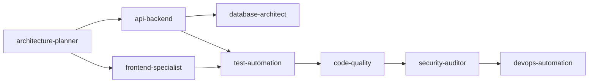

# Claude Agents - AI-Powered SDLC Agent System

[](https://opensource.org/licenses/MIT)
[](https://github.com/pfangueiro/claude-code-agents/releases)
[](https://code.claude.com/docs/en/overview)
[](#-available-agents)
[](#-skills-system)
[](#-mcp-integration)

**13 auto-activating AI agents for every phase of software development.** Just describe what you want to build — the right specialists engage automatically.

> Works with [Claude Code](https://code.claude.com/docs/en/overview) (Anthropic's CLI). No plugins, no configuration, no commands to memorize.

**Requirements:** macOS or Linux with `bash` and `git`; `jq` and `npx` are optional (used for the statusline and MCP examples). See **[INSTALL.md](./INSTALL.md)** for updating, cross-machine migration, and the autonomous self-heal setup.

---

## 30-Second Setup

```bash
git clone https://github.com/pfangueiro/claude-code-agents.git
cd claude-code-agents
./install.sh
```

Installs once, user-global to `~/.claude`. Now **every project on your machine has the agents** — open any project with Claude Code and talk naturally:

```
"Build a REST API with JWT authentication"
"This query is running slow"
"Check for security vulnerabilities"
"Deploy to production"
```

Agents activate automatically based on your words.

> **Before you run it:** see [What the install does to your machine](#what-the-install-does-to-your-machine) for the exact
> paths written, the background daemon, and how to reverse it. `./install.sh --dry-run` prints every
> path it would touch without touching any of them.

---

## What You Get

| Component | Count | What It Does |
|-----------|-------|--------------|
| **Agents** | 13 | Auto-activating SDLC specialists (planning through production) |
| **Skills** | 27 | Modular knowledge packages (git, Docker, CI/CD, K8s, SRE, IaC, observability, experiment-loop, scheduled-tasks, worktree-workflow, remote-triggers, context-escalation, diverge, etc.) |
| **Slash Commands** | 13 | `/commit-pr`, `/review-pr`, `/security-scan`, `/compact`, `/new-feature`, `/create-jira`, `/build-fix`, `/tdd`, `/quality-gate`, `/checkpoint`, `/save-session`, `/resume-session`, `/optimize` |
| **MCP Servers** | 4 | context7, sequential-thinking, playwright, github |
| **Rules** | 6 | Auto-enforced security, code quality, fix quality, verification, framework integrity, and anti-anchoring standards |
| **Hooks** | 10 | Agent tracking, session lifecycle, permission auditing, file protection, auto-lint, debug detection, pre-compact snapshots, notifications |

---

## Available Agents

| Agent | Activates On | Does What | Model |
|-------|-------------|-----------|-------|
| **architecture-planner** | "design", "architecture", "system" | System design, API specs, ADRs | Sonnet |
| **code-quality** | "review", "refactor", "quality" | Code review, best practices | Sonnet |
| **security-auditor** | "security", "auth", "vulnerability" | OWASP scanning, security fixes | **Opus** |
| **test-automation** | "test", "coverage", "TDD" | Test generation, coverage analysis | Sonnet |
| **performance-optimizer** | "slow", "optimize", "bottleneck" | Profiling, caching, optimization | Sonnet |
| **devops-automation** | "deploy", "CI/CD", "Docker" | Deployment, containerization | Sonnet |
| **documentation-maintainer** | "document", "README", "guide" | Docs, API specs | **Haiku** |
| **database-architect** | "database", "SQL", "schema" | Query optimization, migrations | Sonnet |
| **frontend-specialist** | "UI", "React", "frontend" | Components, responsive design | Sonnet |
| **api-backend** | "API", "backend", "endpoint" | REST/GraphQL, business logic | Sonnet |
| **incident-commander** | "CRITICAL", "outage", "emergency" | Rapid response, root cause | **Opus** |
| **sre-specialist** | "SLO", "reliability", "on-call", "runbook" | SRE, SLOs, capacity, chaos eng | Sonnet |
| **meta-agent** | "create an agent for..." | Generates new custom agents | Opus |

**Cost optimization:** Haiku for docs (95% cheaper), Sonnet for dev work, Opus for security/emergencies.

---

## How Agents Collaborate

Agents hand off work automatically. Example: *"Build a user registration system"*


```mermaid
graph LR
    A[architecture-planner] --> B[frontend-specialist]
    A --> C[api-backend]
    C --> D[database-architect]
    B --> E[test-automation]
    C --> E
    E --> F[code-quality]
    F --> G[security-auditor]
    G --> H[devops-automation]
```

See [`.claude/lib/agent-coordination.md`](.claude/lib/agent-coordination.md) for the formal handoff protocol.

---

## Installation

One install, user-global. Claude Code natively loads `~/.claude/{agents,skills,commands,rules}`, so a single install makes the agents available in **every** project on your machine — no per-project setup.

| Command | What It Does |
|---------|-------------|
| `./install.sh` | Install everything to `~/.claude`: agents, skills, commands, rules, hooks, statusline, analytics, global config |
| `./install.sh --dry-run` | Print every path the install would touch — changes nothing |
| `./install.sh --update` | Reconcile an existing install to the latest version |
| `./install.sh --upgrade` | Migrate from an old per-project install: reconcile, confirm + tear down old copies, then self-verify ([details](./INSTALL.md#upgrading-from-the-old-per-project-framework)) |
| `./install.sh --uninstall` | Remove the framework from `~/.claude` — snapshots first, asks first ([details](./INSTALL.md#uninstallation)) |
| `./install.sh --help` | Show all options |

### Verify Installation

```bash
./validate.sh
# All validations passed! (full + --quick modes)
```

Installed components live under `~/.claude/` — verify with `ls ~/.claude/agents ~/.claude/skills ~/.claude/commands ~/.claude/rules`.

---

## What the install does to your machine

`./install.sh` writes to your home directory and installs a background daemon. Here is all of it.
Run `./install.sh --dry-run` first to see the same list resolved against your actual `$HOME`.

### Paths written

| Path | What lands there | On re-install |
|---|---|---|
| `~/.claude/agents/` | 13 agent `.md` files | Replaced (heals drift) |
| `~/.claude/skills/` | 27 skill directories | Replaced per-skill (`rm -rf` then copy) |
| `~/.claude/commands/` | 13 slash-command `.md` files | Replaced |
| `~/.claude/rules/` | 6 rule `.md` files | Replaced |
| `~/.claude/lib/` | 4 reference files (templates, patterns, coordination, MCP guide) | Replaced |
| `~/.claude/hooks/` | 9 hook `.sh` scripts (+`chmod +x`) and 2 reference `.json` configs | Replaced; orphans pruned |
| `~/.claude/output-styles/concise.md` | Code-first output style | Written on first install |
| `~/.claude/statusline.sh` | Status bar script | Replaced only when it differs from source |
| `~/.claude/analytics/` | `collector.py`, `server.py`, `dashboard.html`, `schema.sql` | Replaced |
| `~/.claude/daemon/` | Watchdog script (**macOS only**) | Replaced |
| `~/.claude/settings.json` | Seeded from template if absent; otherwise only framework-owned keys are reconciled — see below | Merged, never wholesale-replaced |
| `~/.claude/CLAUDE.md` | Personal preferences, from template, with your name/email from `git config` | **Only if absent.** Never touched again, including by `--update` |
| `~/.claude/.framework-path`<br>`~/.claude/.framework-version`<br>`~/.claude/.watchdog-plist.sha` | Markers the self-heal paths read | Rewritten |

Written **outside** `~/.claude`:

| Path | Why | Notes |
|---|---|---|
| `~/Library/LaunchAgents/com.claude-code-agents.framework-watchdog.plist` | The hourly self-heal daemon | **macOS only** |
| `~/.zshrc` or `~/.bashrc` | Appends a `claude-obs` alias for the dashboard (3 lines) | Idempotent — guarded by a `grep`, added once |

Created later at runtime, not by the installer: `~/.claude/analytics/*.jsonl` and `claude-obs.db`
(hooks and the collector), `~/.claude/snapshots/` (the daemon), `~/.claude/sessions/`
(pre-compact auto-snapshots, 10 kept per project).

**In `settings.json`, only these keys are framework-owned:** `.hooks` (replaced per event on drift),
`.permissions`, `.attribution`, and `.statusLine` (replaced on drift), plus `.env` (**add-only** —
your values are never overwritten). Every other key you set is left alone. Want different
permissions or attribution? Put them in `settings.local.json`, which takes precedence.

### It is framework-scoped — your own content survives

The install **never** deletes or overwrites a name the framework does not ship. Personal skills,
agents, commands, and rules in `~/.claude` are preserved on every install and every `--update`; the
orphan-prune is only ever *eligible* to remove names the framework itself ships or has explicitly
retired, so a personal entry is not merely spared — it is never a candidate.

Measured, not assumed: with a personal skill, agent, command and rule planted in a throwaway
`HOME`, two consecutive `--update` runs left all four **byte-identical** and the skills directory at
27 framework + 1 personal. A working machine here carries 14 personal skills alongside the
framework's 27; all 41 are present.

### The background daemon

On **macOS**, the install registers an hourly `launchd` agent
(`com.claude-code-agents.framework-watchdog`, `StartInterval 3600`). Each cycle it runs
`validate.sh --quick`, forks `install.sh --update` if it finds drift, `git fsck`s the repo, and
writes daily snapshots to `~/.claude/snapshots/` with 7-day retention. It makes **no network
requests**.

```bash
launchctl list | grep claude-code-agents            # is it running?
tail -f ~/.claude/analytics/watchdog.log            # what did it do?
launchctl bootout gui/$(id -u)/com.claude-code-agents.framework-watchdog   # stop it
```

Full operational detail: **[SELF-HEALING.md](./SELF-HEALING.md)**.

### Platform contract

| | macOS | Linux / WSL |
|---|---|---|
| Agents, skills, commands, rules, lib | Yes | Yes |
| Hooks, statusline, settings reconcile | Yes | Yes |
| Observability dashboard | Yes | Yes |
| SessionStart self-heal hook | Yes | Yes |
| **Hourly watchdog daemon** | **Yes** | **No** — the daemon is Darwin-gated and silently skipped |
| Daily snapshots + retention | Yes | **No** — produced by the watchdog |

On Linux and WSL, drift is still detected and healed, but **only at session start**. There is no
out-of-band recovery, so the one failure the watchdog exists to catch — an external wholesale
rewrite of `~/.claude/settings.json` that drops the `.hooks` block, which disables the SessionStart
hook itself — is not self-recoverable there. Run `./install.sh --update` by hand if the statusline
or hooks disappear.

### Reversing it

```bash
./install.sh --dry-run     # preview every path, change nothing
./install.sh --uninstall   # remove the framework (asks first, snapshots first)
```

`--dry-run` and `--uninstall` read the **same source-derived enumeration** of framework-owned paths,
so the preview cannot drift from the removal.

`--uninstall` asks for confirmation at your terminal, writes a full `~/.claude` tarball to
`~/.claude/snapshots/preuninstall-<UTC>.tgz` and **aborts if that snapshot fails**, unloads and
removes the launchd plist, deletes the framework's own files, and surgically strips the framework's
hook bindings and `statusLine` out of `settings.json` — leaving `settings.json.pre-uninstall.bak`
beside it. It keeps your own skills, agents and commands, your `CLAUDE.md`, `projects/`, `todos/`,
telemetry, and snapshots. It prints the restore command on the way out.

Do **not** `rm -rf ~/.claude`: that directory also holds your own Claude Code data. Snapshot restore
commands: [SELF-HEALING.md](./SELF-HEALING.md#snapshot-restore-claudesnapshots).

Threat model, reporting, and the repo's security posture: **[SECURITY.md](./SECURITY.md)**.

---

## Slash Commands

### Project Workflow

| Command | Usage | What It Does |
|---------|-------|-------------|
| `/commit-pr` | `/commit-pr [message]` | Stage, commit, push, create PR, update JIRA |
| `/review-pr` | `/review-pr 123` | Code quality + security + testing review |
| `/security-scan` | `/security-scan [path]` | OWASP scanning, secrets detection, dependency audit |
| `/compact` | `/compact [note]` | Write HANDOFF.md with session context, then compact conversation |
| `/new-feature` | `/new-feature PROJ-123 desc` | Create feature branch from latest main |
| `/create-jira` | `/create-jira epic Title` | Create JIRA issue and assign to you |

### Developer Workflow (new in v2.5.0)

| Command | Usage | What It Does |
|---------|-------|-------------|
| `/build-fix` | `/build-fix [path]` | Auto-detect build system, fix errors one at a time with regression guard |
| `/tdd` | `/tdd <feature>` | Enforce RED-GREEN-REFACTOR: failing test → implement → refactor |
| `/quality-gate` | `/quality-gate [path] [--fix]` | Pre-commit validation: formatter + linter + type checker + tests |
| `/checkpoint` | `/checkpoint <name>` | Named save points via git branches for complex multi-step work |
| `/save-session` | `/save-session [id]` | Save structured session state with mandatory "What Did NOT Work" section |
| `/resume-session` | `/resume-session [id]` | Resume from a saved session with context briefing and file state verification |
| `/optimize` | `/optimize <metric> [--iterations N]` | Autonomous metric-driven improvement loop: measure → improve → keep/revert |

---

## Skills System

Skills provide domain knowledge that agents apply. 27 included:

| Skill | What It Provides |
|-------|-----------------|
| **git-workflow** | Branching strategies, conventional commits, PR workflows |
| **code-review-checklist** | 10-category review framework, security checklist |
| **deployment-runbook** | Blue-green deployment, rollback procedures, health checks |
| **api-contract-testing** | OpenAPI validation, PACT testing, mock servers |
| **ui-guidelines** | React/Next.js patterns, Ant Design, responsive design |
| **ci-cd-templates** | GitHub Actions, GitLab CI, deployment strategies |
| **docker-deployment** | Multi-stage builds, Docker Compose, security |
| **execute** | Orchestrated task engine: decompose goals, plan dependencies, parallel execution |
| **investigate** | 8-phase root cause analysis: observe, reproduce, trace, hypothesize, prove, fix, prevent |
| **library-docs** | MCP-powered: fetch docs for React, Next.js, Vue, etc. |
| **deep-analysis** | MCP-powered: structured reasoning with branching and revision (rewritten) |
| **diverge** | Divergent ideation: isolated parallel sub-agents + critic pass; the divergent complement to deep-analysis |
| **deep-read** | 6-phase codebase reading engine: scope, map, trace, deep read, connect, report |
| **handoff** | Session continuity — write HANDOFF.md for cross-session context |
| **context-escalation** | Five-level context-pressure policy: truncate → drop-reads → fork-subagent → /compact → handoff |
| **security-scan** | Auto-activating security scanner (secrets, OWASP, dependencies, file permissions) |
| **kubernetes-ops** | K8s manifests, Helm, Karpenter, GitOps (ArgoCD/Flux), network policies, troubleshooting |
| **observability-stack** | OpenTelemetry, Prometheus/Grafana, RED/USE metrics, SLI/SLO monitoring, alerting |
| **sre-runbooks** | On-call handbook, postmortem templates, SLO/error budgets, chaos engineering, capacity planning |
| **infrastructure-as-code** | Terraform/CDK/Pulumi patterns, IaC testing pyramid, CI/CD for infra, state management |
| **experiment-loop** | Autonomous experimentation pattern: modify → measure → keep/discard (autoresearch-inspired) |
| **scheduled-tasks** | CronCreate/CronDelete/CronList for recurring prompts, polling, reminders |
| **worktree-workflow** | Git worktree isolation via EnterWorktree/ExitWorktree — explicit-request-only, session-scoped, single-instance (not a parallelism mechanism) |
| **remote-triggers** | RemoteTrigger API for cross-session automation, scheduled agents |
| **browser-testing** | E2E testing with Playwright MCP — visual regression, responsive design, codegen |
| **multi-agent-orchestration** | Coordinator pattern, teams, background agents, worker restrictions, SendMessage |
| **skill-creator** | Create your own custom skills |

### Create Your Own Skill

```bash
python3 .claude/skills/skill-creator/scripts/init_skill.py my-skill --path .claude/skills
```

---

## MCP Integration

4 Model Context Protocol servers, provided as an example config (`.mcp.json.example`) — install does **not** register them; add the ones you want to Claude Code with the commands below:

| Server | What It Does |
|--------|-------------|
| **context7** | Fetch documentation for 100+ libraries on-demand |
| **sequential-thinking** | Deep structured reasoning (31,999 thinking tokens) |
| **playwright** | Browser automation and E2E testing |
| **github** | PR/issue management via GitHub API |

### Manual MCP Setup

```bash
claude mcp add context7 -- npx @upstash/context7-mcp@latest
claude mcp add sequential-thinking-server -- npx @modelcontextprotocol/server-sequential-thinking
claude mcp add playwright -- npx @executeautomation/playwright-mcp-server
claude mcp add github -- npx -y @modelcontextprotocol/server-github
```

---

## Auto-Enforced Rules

Six rule files in `~/.claude/rules/` are automatically loaded by Claude Code in every session:

- **security.md** — No secrets in commits, parameterized queries, input validation, security headers, least privilege
- **code-quality.md** — No dead code, single responsibility, early returns, explicit error handling, descriptive naming
- **fix-quality.md** — Root cause analysis before fixing, never suppress errors, minimal changes, test-driven fixing
- **verification.md** — Verify after every implementation, run tests, build to catch errors, test-driven bug fixes
- **framework-integrity.md** — Hooks must enforce invariants, state reconciles automatically, snapshots have documented restore paths
- **anti-anchoring.md** — Name the obvious pick + a non-obvious alternative + a trap on open-ended judgment calls; escalate consequential open decisions to `/diverge`

---

## Hooks

10 hook events across 9 command hooks, installed globally to `~/.claude/hooks/`:

| Hook | Event | What It Does |
|------|-------|-------------|
| **session-start-healthcheck.sh** | SessionStart | Fast-path framework drift check (<2s); forks `install.sh --update` on drift |
| **file-protection.sh** | PreToolUse | Blocks edits to sensitive files (.env, *.key, *.pem, secrets/) |
| **post-edit-lint.sh** | PostToolUse | Auto-lints TS/JS after Write/Edit, warns on debug statements |
| **notify.sh** | Notification | Desktop alert when Claude needs attention |
| **agent-tracker.sh** | SubagentStart/Stop | Real-time agent lifecycle tracking to analytics |
| **session-end.sh** | SessionEnd | Logs session completion for observability |
| **smart-guard.sh** | PermissionRequest | Auto-approves safe reads, audits dangerous operations |
| **pre-compact.sh** | PreCompact | Auto-saves session snapshot before context compaction |
| **post-compact.sh** | PostCompact | Verifies session snapshot was saved after compaction |

**Phase 2 reference configs** (opt-in, not enabled by default):
- `smart-file-guard.json` — prompt hook: LLM-based file protection
- `pre-commit-review.json` — agent hook: automated code review before commit

---

## Architecture

Installed once, user-global under `~/.claude/` — Claude Code loads it in every project:

```
~/.claude/
├── agents/          # 13 auto-activating SDLC agents
├── commands/        # 13 slash commands
├── skills/          # 27 modular knowledge packages
├── rules/           # 6 auto-enforced rule sets
├── lib/             # Templates, patterns, coordination protocol
├── hooks/           # 9 command hooks + 2 reference configs
├── daemon/          # launchd watchdog (hourly validate + snapshots) — macOS only
├── analytics/       # Observability dashboard + ingested session logs
├── snapshots/       # Daily repo/config/memory snapshots (written by the daemon)
├── sessions/        # Pre-compact auto-snapshots (written by the PreCompact hook)
├── statusline.sh    # Rich status bar — ends line 1 with a framework-status glyph (✓ healthy / ⟳ self-healing / ⚠ stalled-or-degraded)
└── settings.json    # 10 hook events, permissions, model config
```

Plus one file outside `~/.claude` on macOS —
`~/Library/LaunchAgents/com.claude-code-agents.framework-watchdog.plist` — and a `claude-obs` alias
appended once to your shell rc. See [What the install does to your machine](#what-the-install-does-to-your-machine).

See [EXTENSIBILITY.md](./EXTENSIBILITY.md) for the complete guide on Skills, MCP, Slash Commands, and Subagents.

---

## Usage Examples

**Building a feature:**
```
You: "Build a shopping cart with Stripe integration"
  → architecture-planner designs the system
  → api-backend implements payment logic
  → database-architect creates order schema
  → security-auditor validates payment security
  → test-automation generates tests
  → documentation-maintainer documents the API
```

**Performance issue:**
```
You: "The product search is running really slow"
  → performance-optimizer profiles the code
  → database-architect optimizes queries
  → code-quality suggests improvements
```

**Production emergency:**
```
You: "CRITICAL: Production API is returning 500 errors!"
  → incident-commander takes charge (Opus)
  → security-auditor checks for breaches
  → devops-automation prepares rollback
```

---

## Observability Dashboard

Built-in analytics dashboard that reads Claude Code's native JSONL session logs — zero cloud dependencies, Python stdlib only, single SQLite database.

```bash
# Quick start (after install)
claude-obs

# Or run manually
python3 ~/.claude/analytics/collector.py    # Ingest JSONL → SQLite
python3 ~/.claude/analytics/server.py --open # Serve dashboard at localhost:3141
```

**Dashboard panels:**
- **Summary cards** — total cost, projects, sessions, agent activations, input/output tokens
- **Daily cost & sessions** — dual-axis bar+line chart with configurable time ranges (7d/14d/30d/All)
- **Cost by project** — horizontal bar chart ranking projects by spend
- **Agent activations** — which agents are used most and across how many projects
- **Model distribution** — doughnut chart showing Opus/Sonnet/Haiku cost split
- **Top projects by tokens** — token consumption per project
- **Sessions table** — recent sessions with project, duration, cost, model, and agents used

**Architecture:**
- **Data source**: `~/.claude/projects/**/*.jsonl` (Claude Code writes these automatically)
- **Collector** (`collector.py`): incremental JSONL scanner with per-file watermarks, per-model cost estimation (Opus/Sonnet/Haiku pricing)
- **Storage**: SQLite with WAL mode at `~/.claude/analytics/claude-obs.db`
- **Server** (`server.py`): 6 JSON API endpoints + static file server on `localhost:3141`
- **Dashboard** (`dashboard.html`): single-file dark-themed UI with Chart.js

**What it reads, and where the data goes.** The collector reads Claude Code's own session
transcripts — `~/.claude/projects/**/*.jsonl`, **across every project on the machine**, not just this
one — plus the three JSONL streams the framework's hooks write (`agent-events.jsonl`,
`session-summaries.jsonl`, `permission-audit.jsonl`). Those transcripts contain your prompts and
Claude's responses, so the SQLite database derived from them is as sensitive as your session history.

It **stays local**. `collector.py` makes no network calls of any kind; `server.py` binds
`127.0.0.1:3141` — loopback only, not reachable from your network — and nothing is uploaded,
phoned home, or shared. Both are Python stdlib only, with no third-party dependencies. Delete
`~/.claude/analytics/claude-obs.db` at any time; the next `claude-obs` run rebuilds it.

**CLI options:**
```bash
python3 collector.py --full          # Re-ingest everything (ignore watermarks)
python3 collector.py --db /path/to.db # Custom database path
python3 server.py --port 8080        # Custom port
python3 server.py --open             # Auto-open browser
```

Installed automatically by `./install.sh`. Data stays entirely local.

---

## Contributing

1. Fork the repository
2. Create your feature branch (`git checkout -b feature/my-feature`)
3. Run `./validate.sh` to verify everything passes
4. Commit your changes (`git commit -m 'feat: add my feature'`)
5. Push and open a Pull Request

Read **[docs/FAILURE-MODES.md](./docs/FAILURE-MODES.md)** before adding any check, guard, or fix —
it is the taxonomy of the nine defect classes that actually shipped here, with the real examples.
Full flow and the two hard rules: **[CONTRIBUTING.md](./CONTRIBUTING.md)**.

---

## Roadmap

- [ ] VS Code extension
- [x] Observability dashboard
- [x] Lifecycle hooks (agent tracking, permission auditing, session lifecycle)
- [ ] Additional specialized agents
- [ ] Multi-language support
- [ ] Team collaboration features
- [ ] Custom agent marketplace

---

## License

MIT License - see [LICENSE](LICENSE) for details.

## Support

- [GitHub Issues](https://github.com/pfangueiro/claude-code-agents/issues)
- [GitHub Discussions](https://github.com/pfangueiro/claude-code-agents/discussions)
- Update: `./install.sh --update`

---

<div align="center">

**No configuration. No commands. Just describe what you need.**

Built by [Pedro Fangueiro](https://github.com/pfangueiro) with [Claude](https://anthropic.com)

</div>
